> 범위: 6, 9, 10, 11, 12장
> 

### 데이터의 타입

js 엔진이 다르게 취급하는(메모리 확보, 2진수 변환 결과, 읽어들여 해석하는 방식이 다른) 데이터의 종류 


1. 원시형(Primitive)
    1. 특징: 값을 변경 불가(Immutable)
        1. str 이 참조하고있는 메모리 공간에서 일부의 값만 변경하는 식으로 str의 값을 변경 불가
        2. str 에 저장된 값을 바꾸려면 새로운 메모리 공간에 값을 새로 할당해서 str이 그 주소를 참조하게 변경해야함 
        
        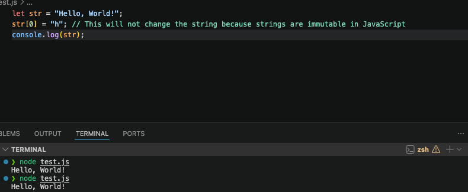
        
    2. 종류: 문자열, 숫자, 불리언, undefined, null 등
        1. 숫자: 실수 단위로 저장 (=배정밀도 64비트 부동소수점 형식의 2진수로 저장)
            
            <aside>
            💡 실수 연산이 정수보다 오래걸려서 js 엔진 내부 최적화로 SMI(small int)로 변환해서 계산
            
           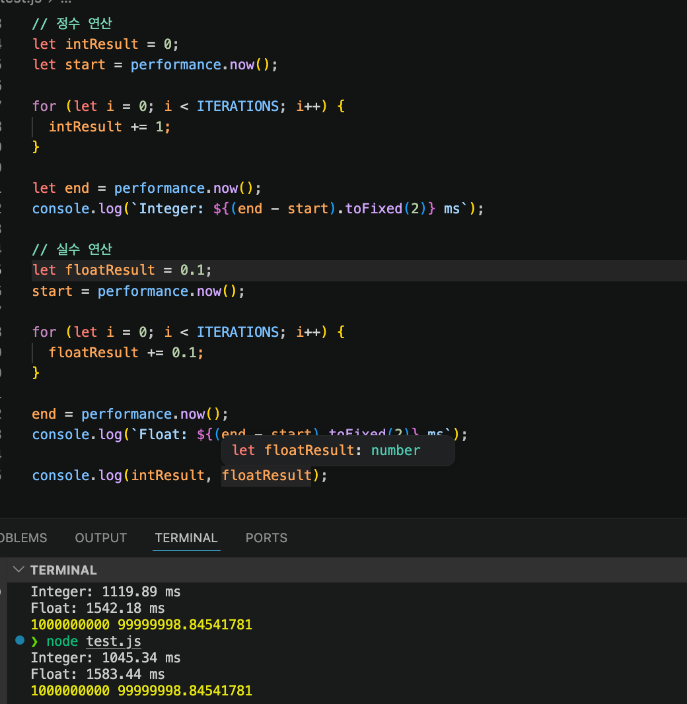
                
            - 실수 연산이 오래걸리는 이유 (정수: 1cycle, 실수: 3~4 cycle)
                1. 지수/가수 분류
                2. 지수맞춤/가수끼리 더함
                3. 결과를 다시 정규화
            - SMI: +-2^30 정수 저장
                
                > 64비트 중 31 비트만 사용. 1 비트는 SMI라는 것을 나타내는 태그로 쓰임 → 스택(MB단위)에 올려서 heap까지 안가도 되게 해서 빠르게 연산 가능하도록 도움
                > 
                - 스택 또는 CPU 레지스터 (변수 자체가 메모리에 할당-정의-된 공간)
                    
            - Heap Number: SMI로 저장되지 않는 모든 number 타입
                - heap 메모리(GB단위. stack 보다 4000배 크다. 64비트 풀로 쓰는 값들을 heap 에 저장)에 number 저장됨
                
                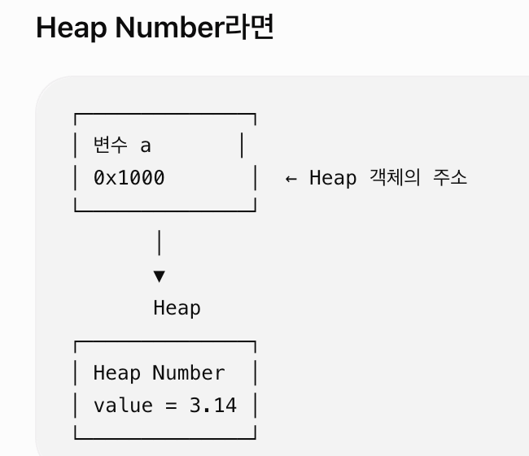
                
            </aside>
            
            1. 저장은 2진수, 해석은 10진수
                - 표현 방식이 달라도(2진수, 10진수, 16진수) 값이 같으면 같게 취급
            2. 종류가 달라도(정수, 실수, 음, 양) 하나의 ‘숫자(number)’ 타입으로 취급
            3. 배정밀도 64비트 부동소수점(Double Precision 64-bit Floating Point) 형식이란?
                1. 숫자에 64개 비트를 사용한다 → 모든 숫자를 저장할 수는 없음(최대 **15~17자리 까지** 정확히 저장 가능) 
                2. 파생되는 유명한 문제
                    
                    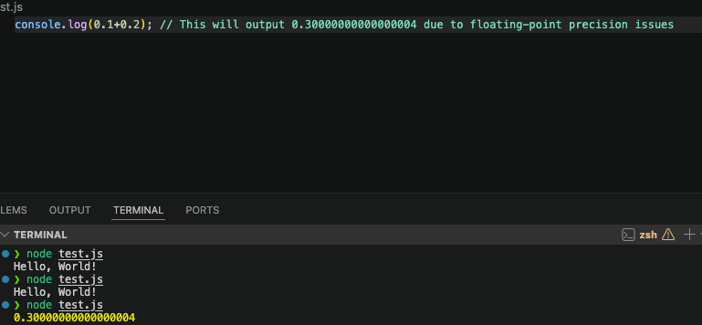
                    
                    - 0.1의 실제 저장 형태가 0.10000000000000000555… 이기 때문
                        
                        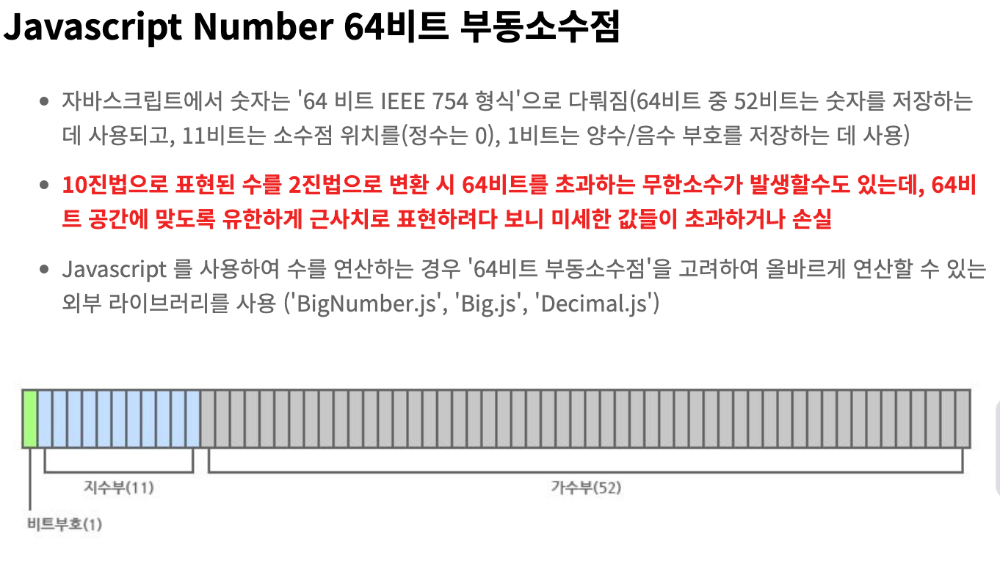
                        > 사진 출처: https://developerkgh.tistory.com/20
            4. 특수 표현: NaN 산술 연산 불가(not a number), 양의 무한대, 음의 무한대
        2. 문자열: 
            1. 대소문자를 구분한다
            2. 16비트 유니코드 문자(UTF-16) 의 집합으로 표현
            3. 임시 배열 객체
                - 인덱스 접근 / 메서드 사용 시, js 엔진이 일시적으로 객체로 바꿔서 배열처럼 접근 가능하게 함 (그래서 원시값이지만 메서드 사용이 가능함)
2. 객체(Object)
    1. 종류: 객체, 함수, 배열 등
    2. 객체의 전달(default): 참조(값이 저장된 주소값을 저장한 주소값)를 전달함 
    3. 객체의 흥미로운 규칙
        1. 예약어는 key로 사용 가능
        2. 중복 key 가 선언되면 나중에 선언된 값으로 덮어씌워짐
        3. 빈 문자열은 key 로 사용가능
        
        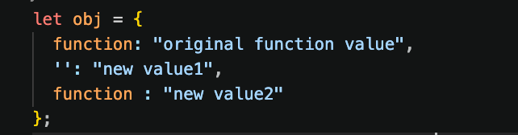
        
        
        
        d. 프로퍼티키를 대괄호로 동적 생성가능
        
        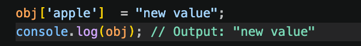
        
        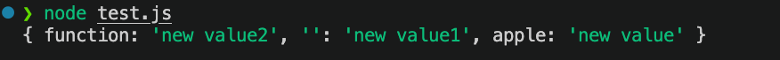
        
        (+ 대괄호로 key 접근 가능 )
        
        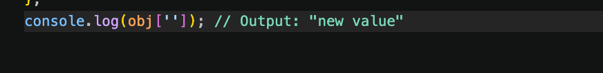
        
    4. js 와 객체
        
        > js는 프로토타입 기반 객체지향 언어이다
        > 
        - 프로토타입 기반 vs 클래스 기반
            
            ES6 이후에는
            
            ```
            classPerson {
              hello() {}
            }
            
            constp=newPerson();
            ```
            
            처럼 클래스 문법도 있다.
            
            하지만 내부적으로는 여전히 **프로토타입 기반이다. (**Prototype→Object**)**
            
            `class`는 개발자가 쓰기 편하도록 제공된 **문법적 설탕(Syntactic Sugar)** 이다
            
        - 동적 탐색
            - v8 같은 js 엔진이 매번 객체를 다시 읽으며 프로퍼티를 찾는 것(컴파일 시점에 객체의 구조가 확정되는 c++ 과 같은 언어에 비해 비효율)
            - 객체 프로퍼티의 동적 생성 수정 삭제
                
                ```jsx
                delete obj.age; // age 프로퍼티가 없어도 에러를 내지 않고 무시됨
                obj.height = 180;
                ```
                
            - js 는 동적으로 객체가 변경되기 때문에 컴파일 시에 오프셋을 미리 정할 수 없음
              > js 는 변수 선언 시 타입을 정하지 않고(var, let 등 사용), 런타임에 값이 할당되는 시점에 값에 해당하는 타입을 부여하는 동적 타입 언어이다
                - 오프셋: 객체 프로퍼티 값이 저장된 메모리 상 시작 위치
                    
                    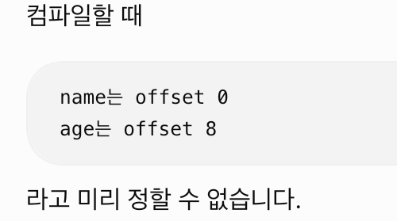
                    
                    - c++의 경우
                        
                        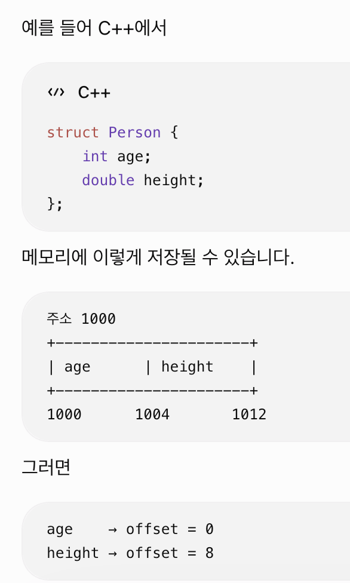
                        
        - 히든 클래스
            - js 엔진이 동적 탐색의 비효율을 해결하기 위해 객체의 프로퍼티 레이아웃을 저장하는 것
                - 각 프로퍼티가 객체 메모리의 몇 번째 위치(offset)에 있는지
                - V8은 동적인 JavaScript 객체를 내부적으로는 C++의 `struct`처럼 취급하여 빠르게 프로퍼티에 접근 가능
        - 객체의 참조
            - 얕은 복사: 객체의 할당은 주소를 재참조하는 식으로 이루어진다. 원본이 바뀌면 사본도 그 결과에 영향을 받는다
                
                ```jsx
                var list = [1,2,3,4]
                var list2 = list
                
                list[0] = 4;
                
                console.log(list2) // 4,2,3,4
                ```
                
                ```jsx
                var obj = {name:"hello"}
                
                var obj2 = obj;
                
                obj.name="change"
                
                console.log(obj2)
                ```
                
3. 함수 (Function)
    - return 에 아무것도 없으면/return 이 없으면 undefined 를 반환
        - 줄바꿈을 하면 엔진이 ; 처리를 해서 결과가 안나옴. 그러나 괄호로 묶으면 줄바꿈을 해도 값이 나옴
        
        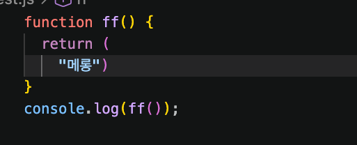
        
        
        
    - 표현식(expression) vs 문(statement)
        - 표현식: 값으로 바뀌는 것 (jsx 내부에서 사용 가능)
            - 삼항 연산자, x+y
        - 문: 값으로 바뀌지 않는 것
            - 함수 선언**문**
    - 함수 종류
        - 중첩 함수
            - 함수 안에서 함수가 실행된다
        - 고차 함수
            - 함수를 값처럼 다루는 함수
                - 매개변수로 함수를 전달받거나
                - 함수를 return 하는 함수
        - 콜백 함수
            - 다른 함수에 매개변수로 전달되어 나중에 호출되는 함수
        - 순수 함수
            - 같은 입력에 같은 출력
            - 외부에 변경을 만들지 않음
        - 헷갈릴 만한 것들 실험
            
            ```jsx
            function foo() {
              console.log("hello");
            }
            
            function outer() {
              foo();
            
              function foo() {
                console.log("hi");
              }
              
            }
            
            outer(); // hi
            ```
        
    - 함수 생성 방식
        - 함수 선언문 (Function Declaration)
            - `function foo() {}`
            - 함수 호이스팅이 적용됨 (아래에서 다룸)
    
        - 함수 표현식 (Function Expression)
            - `const foo = function() {}`
            - 화살표 함수도 함수 표현식의 한 종류
            - 변수 호이스팅 규칙을 따름 (아래에서 다룸)
    
        - 화살표 함수 (Arrow Function)
            - `const foo = () => {}`
            - `this`, `arguments` 등을 자체적으로 가지지 않는 등 일반 함수와 차이점이 있음
    
        - Function 생성자 -> 권장 X
            - `new Function(...)`
            - 런타임에 문자열을 파싱하여 함수를 생성
            - 성능이 좋지 않음
            - 클로저를 생성하지 않음
            - 문자열을 실행하므로 보안상 권장되지 않음
              
    - 호이스팅
        - 변수와 함수 선언이 스코프의 최상단으로 끌어올려진 것처럼 동작하는 자바스크립트의 동작 방식
    
        - 함수 호이스팅 (Function Hoisting)
            - **함수 선언문(`function foo() {}`)** 에만 적용
            - 실행 전에 함수 객체가 미리 생성되어 메모리에 등록됨
            - 따라서 선언 전에 호출해도 정상 동작
    
            ```js
            sayHello(); // "Hello"
    
            function sayHello() {
              console.log("Hello");
            }
            ```
    
        - 변수 호이스팅 (Variable Hoisting)
            - `var`, `let`, `const`와 **함수 표현식**(`const foo = () => {}`)에 적용
            - 실행 전에 변수 이름은 현재 스코프에 등록됨
            - 초기화 방식은 선언 키워드에 따라 다름
                - `var` : `undefined`로 초기화되어 선언 전에 접근 가능
                - `let`, `const` : TDZ(Temporal Dead Zone) 상태이므로 초기화 전에는 접근 불가 (`ReferenceError`)
    
            - 함수 표현식은 함수 호이스팅이 아니라 **변수 호이스팅**을 따름
    
            ```js
            hello(); // ❌
    
            const hello = () => {
              console.log("Hello");
            };
            ```
    
            - `hello`라는 변수만 먼저 등록되고, 함수는 선언문이 실행되는 시점에 변수에 할당됨
    
            ```js
            undo: async () => {
              sourceTextureManager.setSize(); // ❌
    
              const sourceTextureManager =
                getSourceTextureManager(...);
            }
            ```
    
            ```
            Cannot access 'sourceTextureManager' before initialization
            ```
    
            - 원인
                - `const sourceTextureManager`가 함수 스코프의 지역 변수로 먼저 등록됨(Shadowing)
                - 하지만 아직 초기화되지 않은 상태(TDZ)이므로 위에서 접근하면 `ReferenceError` 발생
